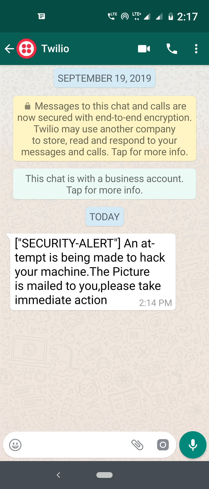

# Face-Recognition-based-secured-login-system
### Prevent Unauthorized access to your machine by this amazing piece of code which will not allow any hacker to manually enter your system even if he knows your password using face recognition techniques along with whatsapp,mail and audiobot functionalities.

#### Walkthrough of this system
##### 1.) This system is activated every time the system is booted and uses face_recognition to identify whether the person trying to open the machine is you or someone else.
##### 2.) If it detects and recognises your face then an audio bot will welcome you and the system will close.
###### My face correctly detected (*This is for testing purpose only)
 Else if the system cannot recognise your face for few seconds then : 

##### a) You will get a whatsapp message on your number alerting you about the hack 

###### I get a whatsapp alert

##### b) You will get an email on your mail updating you about the person who is trying to hack your machine by sending his/her photo with a timestamp.

##### The email 

##### The picture of the hacker with the metadata

##### c)An audio bot warning the hacker will be played.

###### The warning message

##### d)The system will shut down.

### Stay safe,stay happy.
### Learn,Code,Share => Thank you..!!
